# Architecture Cible du Projet BoardGame

Ce document décrit la structure de dossier recommandée pour garder une séparation nette entre le métier et la technique.

## Principe général

Le projet doit suivre une séparation en couches simple:

- `domain` contient le coeur métier
- `application` orchestre les cas d'usage
- `presentation` gère l'interface utilisateur
- `infrastructure` gère les détails techniques comme les fichiers

L'objectif est que le code métier ne dépende pas du code technique.

## Structure recommandée

```text
src/main/java/fr/fges/
  Main.java
  domain/
    model/
    port/
    service/
  application/
    command/
  presentation/
  infrastructure/
    repository/
```

## Rôle de chaque dossier

### `domain/model`

Contient les objets métier et les valeurs du domaine.

Exemples:

- `BoardGame`
- `Tournament`
- `Player`
- `Match`
- `Action`
- `ActionHistory`

Règle: ces classes ne doivent pas dépendre de l'UI ni du stockage.

### `domain/service`

Contient la logique métier pure.

Exemples:

- `GameService`
- `GameManagementService`
- `GameRecommendationService`
- `GameHistoryService`
- `TournamentService`

Règle: un service métier ne doit pas afficher du texte à l'utilisateur.

### `domain/port`

Contient les contrats que le domaine attend.

Exemples:

- `GameRepository`
- `GameMutationPort`

Règle: le domaine définit le besoin, l'infrastructure fournit l'implémentation.

### `application/command`

Contient les cas d'usage orientés interface.

Exemples:

- `AddAction`
- `RemoveGameCommand`
- `ListGamesCommand`
- `RecommendGameCommand`
- `UndoCommand`

Règle: ces classes orchestrent l'entrée utilisateur et appellent les services.

### `presentation`

Contient l'affichage et la saisie utilisateur.

Exemples:

- `Menu`
- `MenuDisplay`
- `InputHandler`
- `TournamentFormatter`

Règle: cette couche parle à l'utilisateur, pas au stockage.

### `infrastructure/repository`

Contient les implémentations techniques du stockage.

Exemples:

- `CsvGameRepository`
- `JsonGameRepository`

Règle: cette couche dépend du domaine, jamais l'inverse.

## Structure recommandée pour les tests

```text
src/test/java/fr/fges/
  domain/
    service/
      facade/
      history/
      management/
      recommendation/
  samplecode/
```

### Idée de découpage des tests

- `domain/service/management` pour le CRUD et les règles de base
- `domain/service/recommendation` pour les recherches et recommandations
- `domain/service/history` pour l'undo et l'historique
- `domain/service/facade` pour vérifier l'assemblage de `GameService`

## Ce que cette structure améliore

1. Les fichiers sont plus petits et plus lisibles.
2. Les responsabilités sont claires.
3. Les tests sont plus faciles à retrouver.
4. Le métier devient plus simple à faire évoluer.
5. La technique peut changer sans casser le coeur du projet.

## Règle pratique simple

Si une classe parle à l'utilisateur, elle va dans `presentation`.

Si une classe contient une règle métier, elle va dans `domain`.

Si une classe lit ou écrit un fichier, elle va dans `infrastructure`.

Si une classe sert à relier une action UI à un service métier, elle va dans `application`.

---

## Diagramme de classes complet

```mermaid
graph TD
    %% ── PRESENTATION ──────────────────────────
    subgraph PRESENTATION["Présentation"]
        Menu
        MenuDisplay
        InputHandler
        TournamentFormatter
    end

    %% ── APPLICATION ───────────────────────────
    subgraph APPLICATION["Application — Commands"]
        CMD["«interface»\nCommand"]

        subgraph GAME_CMD["Jeux"]
            AddGameCommand
            RemoveGameCommand
            ListGamesCommand
            RecommendGameCommand
            FindGamesByPlayerCountCommand
            UndoCommand
            WeekendSummaryCommand
        end

        subgraph TOURNAMENT_CMD["Tournois"]
            TournamentCommand
            TournamentMenuCommand
            TournamentSessionCommand
        end

        subgraph SYS_CMD["Système"]
            ExitCommand
        end
    end

    %% ── DOMAIN ────────────────────────────────
    subgraph DOMAIN["Domaine"]
        subgraph SERVICES["Services métier"]
            GameService
            GameManagementService
            GameRecommendationService
            GameHistoryService
            TournamentService
        end

        subgraph STRATEGY["«Strategy» Format tournoi"]
            TournamentFormat["«interface»\nTournamentFormat"]
            RoundRobinFormat
            KingOfTheHillFormat
        end

        subgraph MODEL["Modèle"]
            BoardGame
            Tournament
            Player
            Match
            ActionHistory
            Action["«interface»\nAction"]
            AddAction
            RemoveAction
        end

        subgraph PORTS["«Ports»"]
            GameRepository["«interface»\nGameRepository"]
            GameMutationPort["«interface»\nGameMutationPort"]
        end
    end

    %% ── INFRASTRUCTURE ────────────────────────
    subgraph INFRA["Infrastructure"]
        JsonGameRepository
        CsvGameRepository
    end

    %% ── EXCEPTIONS ────────────────────────────
    subgraph EXC["Exceptions"]
        DuplicateGameException
        MenuExitException
    end

    %% ── RELATIONS ─────────────────────────────

    %% Présentation → Application
    Menu --> CMD
    Menu --> MenuDisplay
    Menu --> InputHandler
    TournamentMenuCommand --> TournamentFormatter

    %% Commands → Interface
    AddGameCommand & RemoveGameCommand & ListGamesCommand --> CMD
    RecommendGameCommand & FindGamesByPlayerCountCommand & UndoCommand --> CMD
    WeekendSummaryCommand & ExitCommand --> CMD
    TournamentCommand & TournamentMenuCommand & TournamentSessionCommand --> CMD

    %% Commands → Services
    AddGameCommand & RemoveGameCommand --> GameManagementService
    ListGamesCommand & WeekendSummaryCommand --> GameService
    RecommendGameCommand & FindGamesByPlayerCountCommand --> GameRecommendationService
    UndoCommand --> GameHistoryService
    TournamentMenuCommand & TournamentSessionCommand --> TournamentService

    %% Services → Ports
    GameService & GameRecommendationService --> GameRepository
    GameManagementService --> GameMutationPort
    GameManagementService --> ActionHistory
    GameHistoryService --> ActionHistory

    %% TournamentService → Strategy & Model
    TournamentService --> TournamentFormat
    TournamentService --> Tournament
    RoundRobinFormat & KingOfTheHillFormat -.->|implémente| TournamentFormat

    %% Model interne
    Tournament --> Player
    Tournament --> Match
    Match --> Player
    ActionHistory --> Action
    AddAction & RemoveAction -.->|implémente| Action
    AddAction & RemoveAction --> BoardGame

    %% Infrastructure → Port
    JsonGameRepository & CsvGameRepository -.->|implémente| GameRepository

    %% Exceptions
    AddGameCommand -.->|lève| DuplicateGameException
    ExitCommand & TournamentService -.->|lève| MenuExitException

    %% Styles
    classDef layer fill:#1e293b,stroke:#334155,color:#f8fafc,font-weight:bold
    classDef interface fill:#0f172a,stroke:#6366f1,color:#a5b4fc,stroke-dasharray:5
    classDef service fill:#164e63,stroke:#0891b2,color:#e0f2fe
    classDef model fill:#14532d,stroke:#16a34a,color:#dcfce7
    classDef infra fill:#7c2d12,stroke:#ea580c,color:#ffedd5
    classDef exc fill:#581c87,stroke:#a855f7,color:#f3e8ff
    classDef cmd fill:#1e3a5f,stroke:#3b82f6,color:#bfdbfe

    class CMD,TournamentFormat,GameRepository,GameMutationPort,Action interface
    class GameService,GameManagementService,GameRecommendationService,GameHistoryService,TournamentService service
    class BoardGame,Tournament,Player,Match,ActionHistory,AddAction,RemoveAction model
    class JsonGameRepository,CsvGameRepository,RoundRobinFormat,KingOfTheHillFormat infra
    class DuplicateGameException,MenuExitException exc
    class AddGameCommand,RemoveGameCommand,ListGamesCommand,RecommendGameCommand,FindGamesByPlayerCountCommand,UndoCommand,WeekendSummaryCommand,ExitCommand,TournamentCommand,TournamentMenuCommand,TournamentSessionCommand cmd
```




